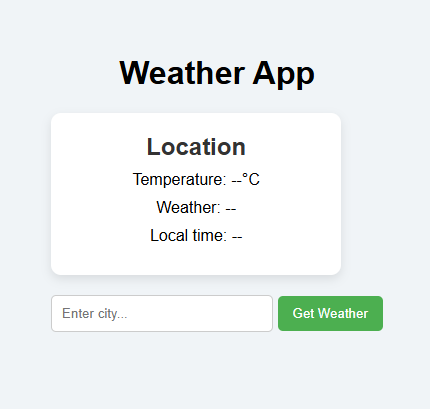
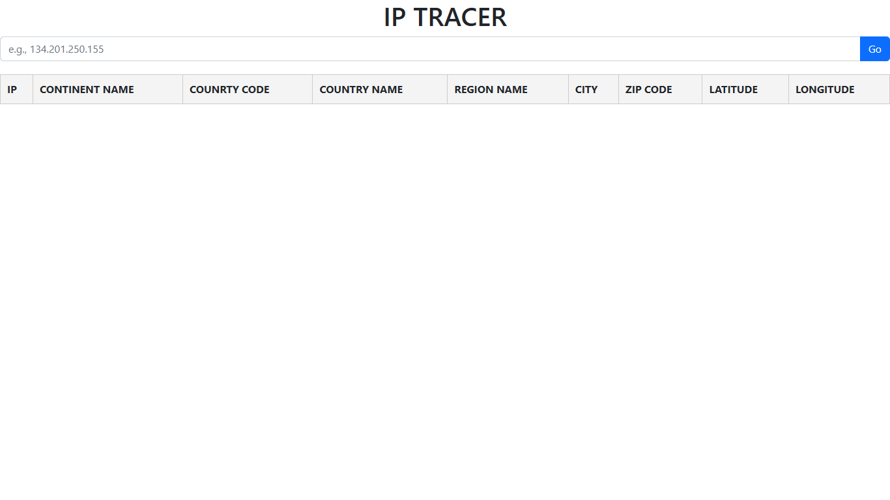

# Weather App and IP Tracer App

Welcome to the **Weather App** and **IP Tracer App**! This repository contains two separate applications:
1. A Weather App that fetches and displays real-time weather information for a city using an API.
2. An IP Tracer App that locates a user's geographic position using their IP address.

---

## Weather App
---


### Features
- Fetches current weather data for any city.
- Displays information such as temperature, humidity, wind speed, and weather conditions.
- User-friendly interface with city search functionality.

### Technologies Used
- **Frontend**: HTML, CSS, JavaScript
- **API**: Weatherstack API

### Setup Instructions
1. Clone the repository:
   ```bash
   git clone https://github.com/BertramChabu/Weather-and-IP-Tracer.git
   ```
2. Obtain an API key from http://api.weatherstack.com.
3. Create a `.env` file in the project directory and add your API key:
   ```env
   WEATHER_API_KEY=your_api_key_here
   ```
4. Open the `index.html` file in your browser or deploy the app to a web server.

### How to Use
1. Enter the name of the city in the search bar.
2. Click "Search" to view the current weather information for the city.
3. Weather details will be displayed on the screen.

---

## IP Tracer App
---


### Features
- Retrieves the user's location based on their public IP address.
- Displays information such as city, region, country, and approximate coordinates.
- Interactive map integration to visualize the location.

### Technologies Used
- **Frontend**: HTML, CSS, JavaScript
- **API**: IP Geolocation API (e.g., ipinfo.io or ipstack)

### Setup Instructions
1. Clone the repository:
   ```bash
   git clone https://github.com/BertramChabu/Weather-and-IP-Tracer.git
   ```
2. Obtain an API key from a geolocation service like [ipinfo.io](https://ipinfo.io/) or [ipstack](https://ipstack.com/).
3. Create a `.env` file in the project directory and add your API key:
   ```env
   IP_API_KEY=your_api_key_here
   ```
4. Open the `index.html` file in your browser or deploy the app to a web server.

### How to Use
1. Open the application in your browser.
2. The app will automatically fetch your IP and display your location details.
3. Use the map (if integrated) to view your location visually.

---

## Contributing
We welcome contributions! If you'd like to improve these applications or fix bugs:
1. Fork this repository.
2. Create a new branch for your changes.
3. Submit a pull request with a detailed explanation of your changes.

---

## License
This project is licensed under the MIT License. See the LICENSE file for details.

---

## Acknowledgments
- **Weather App**: Powered by the [OpenWeatherMap API](https://weatherstack.com/).
- **IP Tracer App**: Powered by [ipinfo.io](https://ipinfo.io/) or [ipstack](https://ipstack.com/).


---
